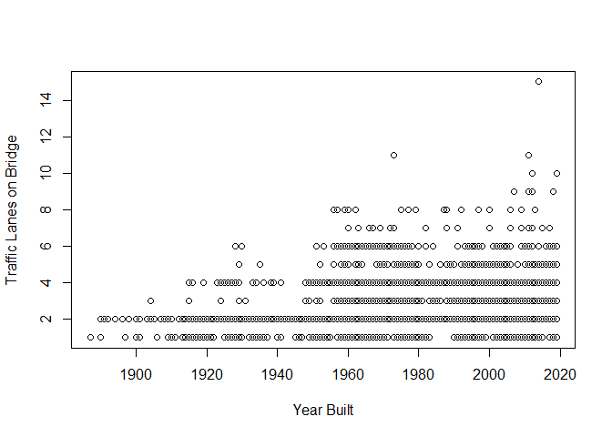

README
================
Alex Hertadi
9/16/2021

First, pull the dataset from the internet.

``` r
library(readr)
x = read_csv("https://www.fhwa.dot.gov/bridge/nbi/2020/delimited/WI20.txt")
```

    ## Rows: 14271 Columns: 123

    ## -- Column specification --------------------------------------------------------
    ## Delimiter: ","
    ## chr (49): STRUCTURE_NUMBER_008, ROUTE_NUMBER_005D, HIGHWAY_DISTRICT_002, COU...
    ## dbl (72): STATE_CODE_001, RECORD_TYPE_005A, ROUTE_PREFIX_005B, SERVICE_LEVEL...
    ## lgl  (2): CRITICAL_FACILITY_006B, TEMP_STRUCTURE_103

    ## 
    ## i Use `spec()` to retrieve the full column specification for this data.
    ## i Specify the column types or set `show_col_types = FALSE` to quiet this message.

``` r
x
```

    ## # A tibble: 14,271 x 123
    ##    STATE_CODE_001 STRUCTURE_NUMBER_008 RECORD_TYPE_005A ROUTE_PREFIX_005B
    ##             <dbl> <chr>                           <dbl>             <dbl>
    ##  1             55 00000000000F303                     1                 6
    ##  2             55 00000000000F304                     1                 6
    ##  3             55 00000000000F310                     1                 6
    ##  4             55 00000000000F311                     1                 6
    ##  5             55 00000000000F315                     1                 6
    ##  6             55 00000000000F317                     1                 6
    ##  7             55 00000000000F318                     1                 6
    ##  8             55 00000000000F321                     1                 6
    ##  9             55 00000000000F323                     1                 6
    ## 10             55 00000000000F324                     1                 6
    ## # ... with 14,261 more rows, and 119 more variables: SERVICE_LEVEL_005C <dbl>,
    ## #   ROUTE_NUMBER_005D <chr>, DIRECTION_005E <dbl>, HIGHWAY_DISTRICT_002 <chr>,
    ## #   COUNTY_CODE_003 <chr>, PLACE_CODE_004 <chr>, FEATURES_DESC_006A <chr>,
    ## #   CRITICAL_FACILITY_006B <lgl>, FACILITY_CARRIED_007 <chr>,
    ## #   LOCATION_009 <chr>, MIN_VERT_CLR_010 <dbl>, KILOPOINT_011 <dbl>,
    ## #   BASE_HWY_NETWORK_012 <dbl>, LRS_INV_ROUTE_013A <chr>,
    ## #   SUBROUTE_NO_013B <dbl>, LAT_016 <dbl>, LONG_017 <chr>, ...

Make a data frame subset and plot interesting values.

``` r
y = data.frame(x$STRUCTURE_NUMBER_008,x$YEAR_BUILT_027,x$BRIDGE_CONDITION, x$TRAFFIC_LANES_ON_028A)
head(y)
```

    ##   x.STRUCTURE_NUMBER_008 x.YEAR_BUILT_027 x.BRIDGE_CONDITION
    ## 1        00000000000F303             1932                  P
    ## 2        00000000000F304             1974                  P
    ## 3        00000000000F310             1948                  F
    ## 4        00000000000F311             1979                  F
    ## 5        00000000000F315             1977                  F
    ## 6        00000000000F317             1980                  G
    ##   x.TRAFFIC_LANES_ON_028A
    ## 1                       2
    ## 2                       1
    ## 3                       2
    ## 4                       2
    ## 5                       2
    ## 6                       2

``` r
tail(y)
```

    ##       x.STRUCTURE_NUMBER_008 x.YEAR_BUILT_027 x.BRIDGE_CONDITION
    ## 14266        P71093800000000             1950                  P
    ## 14267        P71094000000000             1992                  G
    ## 14268        P73090300000000             1930                  P
    ## 14269        P73090400000000             1957                  P
    ## 14270        P73090700000000             1979                  F
    ## 14271        P73091200000000             1970                  F
    ##       x.TRAFFIC_LANES_ON_028A
    ## 14266                       2
    ## 14267                       2
    ## 14268                       2
    ## 14269                       2
    ## 14270                       2
    ## 14271                       2

``` r
plot(x$YEAR_BUILT_027, x$TRAFFIC_LANES_ON_028A, xlab = "Year Built", ylab = "Traffic Lanes on Bridge")
```

<!-- -->

Github Link : <https://github.com/afh1760/Stat433>
